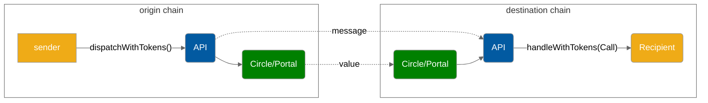

# Liquidity Layer V2 API


The LiquidityLayer V2 API is in beta. The API is subject to change


Hyperlane's Liquidity layer wraps token bridges to allow developers to send tokens.

### TODO : copy from diagrams


#### Supported Bridges

* Circle
  * Token: USDC
  * Chains: Etherum and Avalanche C-Chain (Mainnet), Goerli and Fuji (Testnet)

### Send

Developers can send interchain messages very similarly to the [messaging-api](../apis/messaging-api/ "mention") by calling the `LiquidityLayerRouter.dispatchWithTokens` endpoint. At the moment, dispatched messages must be received by a contract with the `handleWithTokens()` function. You will learn more about this in the [Receive](../apis/messaging-api/receive.md) section up next, but for now let's cover the message sending interface. Remember that you need to ERC-20-approve the tokens to the `LiquidityLayerRouter`, otherwise it is not authorized to move them.

#### Interface

```solidity
// SPDX-License-Identifier: MIT OR Apache-2.0
pragma solidity >=0.6.11;

interface ILiquidityLayerAdapterV2 {
    function transferRemote(
        uint32 _destinationDomain,
        bytes32 _recipientAddress,
        uint256 _amount
    ) external payable returns (bytes32);
}
```

`_destinationDomain` is the chain you're sending to. Domain ID's can be found [here](../resources/domains.md).

`_recipientAddress` is the receiving contract.

`_amount` is the amount of USDC you want to transfer

### TODO : interchain gas
### Paying for Interchain Gas

Just like all Hyperlane messages that wish to have their messages delivered by a relayer, users must [pay for interchain gas](../build-with-hyperlane/guides/paying-for-interchain-gas.md).

The `dispatchWithTokens` function in the Liquidity Layer API returns the message ID as a `bytes32`. This message ID can then be used by the caller to pay for interchain gas.

Because the Liquidity Layer uses the default ISM for security, the [DefaultIsmInterchainGasPaymaster](../resources/addresses.md#defaultisminterchaingaspaymaster-1) IGP should be used. When specifying the amount of gas, the caller must pay for a gas amount high enough to cover:

1. "Overhead" gas used by the Liquidity Layer contract on the destination chain. This is about **280,000 gas**. This is because the actual cost of bridging the tokens via the underlying Circle or Portal bridge can be fairly high.
2. The gas used by the recipient's `handleWithTokens` function on the destination chain.

#### Gas Payment Example

```solidity
function dispatchWithTokensAndPayGas() external payable {
    // First, dispatch with tokens
    bytes32 messageId = liquidityLayer.dispatchWithTokens(/* ... */);

    // Then, pay for gas

    // The mainnet DefaultIsmInterchainGasPaymaster
    IInterchainGasPaymaster igp = IInterchainGasPaymaster(
        0x56f52c0A1ddcD557285f7CBc782D3d83096CE1Cc
    );
    // Pay with the msg.value
    igp.payForGas{ value: msg.value }(
         // The ID of the message
         messageId,
         // Destination domain
         destinationDomain,
         // The total gas amount. This should be the
         // overhead gas amount (280,000 gas) + gas used by the call being made.
         // For example, if the handleWithTokens function uses 120,000 gas,
         // we pay for 400k gas.
         400000,
         // Refund the msg.sender
         msg.sender
     );
}
```
