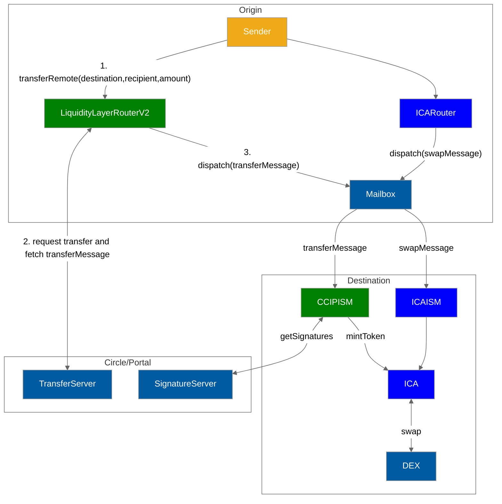

```mermaid
%%{ init: {
  "theme": "neutral",
  "themeVariables": {
    "mainBkg": "#025AA1",
    "textColor": "white",
    "clusterBkg": "white"
  },
  "themeCSS": ".edgeLabel { color: black }"
}}%%

flowchart TD
    subgraph Circle/Portal
        TransferServer
    end

    subgraph Circle/Portal
        SignatureServer
    end

    subgraph Origin
        Sender --"1. transferRemote(destination,recipient,amount)"--> LiquidityLayerRouterV2
        Sender --> ICARouter

        ICARouter --"dispatch(swapMessage)"--> OMailbox[Mailbox]

        LiquidityLayerRouterV2 <-- "2. request transfer and fetch transferMessage"--> TransferServer
        LiquidityLayerRouterV2 --"3. dispatch(transferMessage)"--> OMailbox[Mailbox]
    end

CCIPISM <--"getSignatures"--> SignatureServer

    subgraph Destination

        OMailbox --"transferMessage"--> CCIPISM
        
        CCIPISM --"mintToken"--> ICA
        OMailbox -- "swapMessage"--> ICAISM
        ICAISM --> ICA
        
        ICA <--"swap"--> DEX 
    end

style Sender fill:#efab17
style LiquidityLayerRouterV2 fill:green
style ICARouter fill:blue
style CCIPISM fill:green
style ICAISM fill:blue
style ICA fill:blue
```
